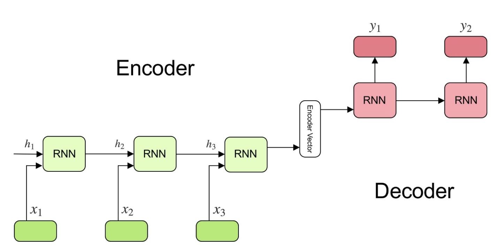
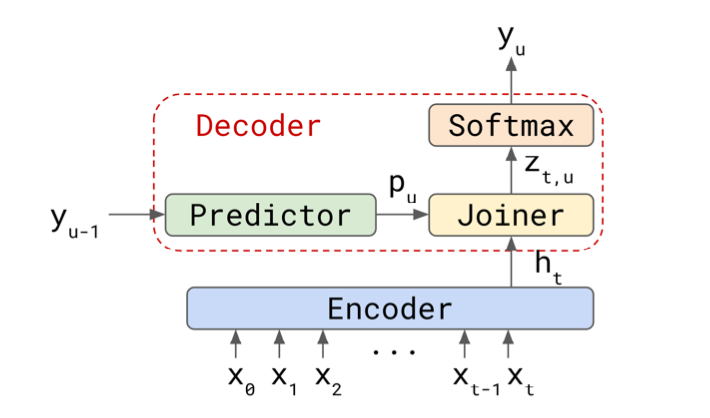

# W266_Project
W266 Project - Automatic Speech Recognition using Transducers

## Base model 

Implemented in se2seq.ipynb file

### Model Parameters
 - LSTM RNN with hidden layer size 1024 
 - Both Encoder and Decoder use 2 layer cascaded LSTMs
 - Dropout of 0.2 and teacher forcing ratio of 90%
 - ADAM optimizer with exponential decay of learning rate

## Transducer model 

Implemented in transducer_asr.ipynb file

### Model Parameters
 - GRU RNN with hidden layer size 1024 
 - The Encoder uses 3 layer cascaded GRU and decoder uses one layer GRU
 - Dropout of 0.1 
 - ADAM optimizer with exponential decay of learning rate

## Transducer model with speech input

Implemented in asr_train.ipynb file
 - Speech data samples at 16KHz, Hanning window of 20msec and 10mse overlap
 - 64 MFCC coefficient computer using 512 DFT
 - Computationally very intensive - hence did not train the model completely
